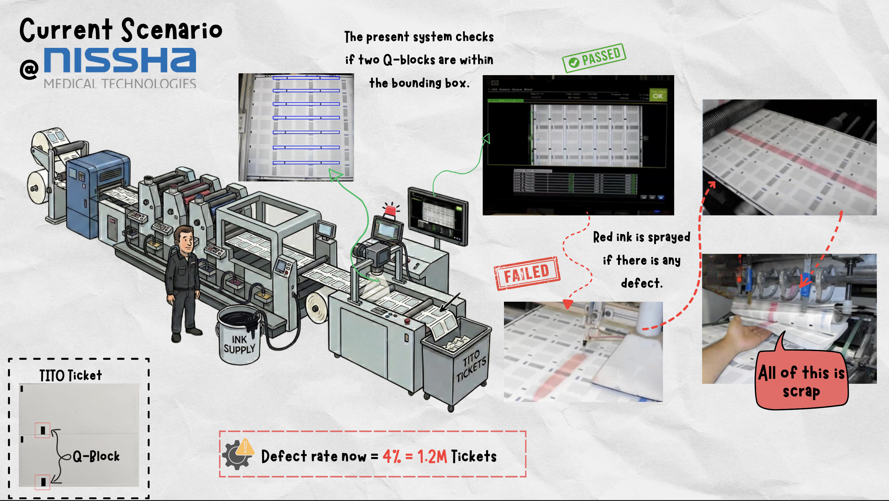
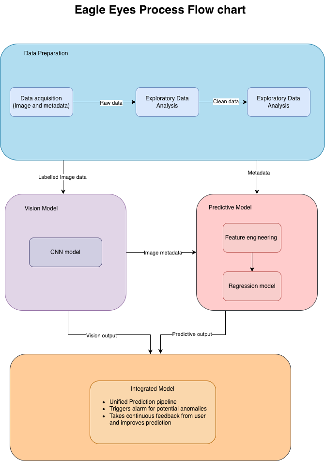
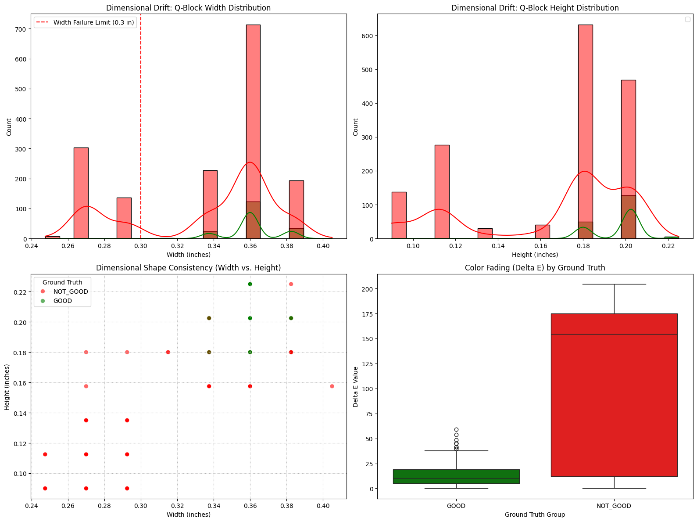
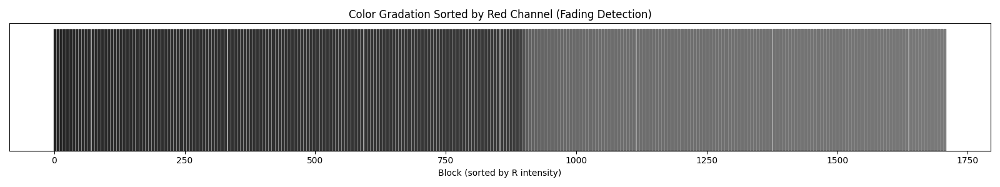
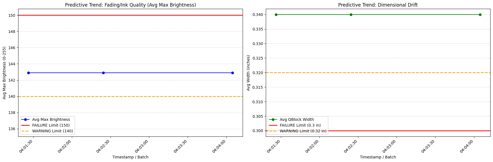

# Project BlockBusters 👁️‍🗨️: Vision based predictive quality control in high-speed manufacturing

A Computer Vision & Predictive Maintenance pipeline designed to detect, measure, and predict manufacturing defects in high-speed printing environments.

# 📖 The Story & Problem Statement
In the high-stakes world of industrial printing, specifically for casino TITO (Ticket-In, Ticket-Out) vouchers - precision is non-negotiable.



**The Challenge**
The printing process relies on "Q-blocks" (small black registration marks) printed on the back of every ticket. These blocks tell the slot machines exactly where to cut and read the ticket.


* **The Issue**: If these blocks fade (ink starvation), drift in size (roller pressure issues), or go missing, the tickets are useless.

* **The Bottleneck**: Manual inspection is impossible at production speeds, and traditional sensors often miss subtle "drift" that indicates a machine is about to fail.

**The Objective**

Project Eagle Eyes was built to solve this by moving from **Reactive Repairs** (fixing it after it breaks) to **Predictive Maintenance** (fixing it before it fails). The goal is to build a system that doesn't just "see" defects, but understands the trend of quality degradation.


## 💡 The Approach
To tackle this, We developed a hybrid pipeline that combines Deep Learning for object detection with Statistical Process Control (SPC) for analysis.

1. Detect (Computer Vision): Use a robust YOLO model to locate Q-blocks regardless of slight lighting or position variations.

2. Measure (Feature Engineering): Once detected, mathematically extract the "vital signs" of the block (Width, Height, Pixel Intensity).

3. Predict (Statistical Logic): Compare these vital signs against historical trends. If the ink is fading slowly, alert the operator now even before the ink runs out completely.

## System Architecture

<!--  -->

<!--  -->

<div align="center">
  
</div>

**Core Components**

* **The Brain (YOLOv8n)**: A nano-scale model chosen for its high inference speed, fine-tuned via Transfer Learning on the eagle-eyes dataset to specifically recognize Q-blocks.

* **The Eyes (OpenCV)**: Used for pre-processing and extracting raw pixel data from the bounding boxes generated by YOLO.

* **The Logic (Pandas & SciPy)**: Handles the statistical heavy lifting, calculating rolling averages, standard deviations, and Delta-E color metrics.

## Pipeline Steps

**Dataset Download**: Fetches the latest "eagle-eyes" dataset (including trained weights and data config) from [Roboflow](https://app.roboflow.com/nissha-medical).

**Model Training**: Trains a custom YOLOv8n model using transfer learning to accurately locate Q-blocks.

**Feature Extraction**: Extracts dimensional (Width_in, Height_in) and color (R, G, B, Brightness, Delta_E) metrics for every detected Q-block.

**Real-Time QC Check**: Classifies each image as 'PASS' or 'FAIL' based on multiple criteria (Count, Dimension, Color).

**Predictive Maintenance (PdM)**: Logs image-level metrics (e.g., Average Width, Max Brightness) to a history file and analyzes the trend to issue early maintenance warnings.

## Quality Control & Predictive Logic

The QC pipeline implements a robust, multi-metric pass/fail decision structure, moving beyond simple object detection counts.

| Metric | Business Logic | Status |
| :--- | :--- | :--- |
| **Detection Count** | Must detect exactly **14** blocks (`EXPECTED_QBLOCK_COUNT`). | `FAIL_COUNT` |
| **Dimension Drift** | Average Q-block width must be above `QC_MIN_WIDTH_IN`. | `FAIL_DIMENSION` |
| **Color Fading** | Max block brightness must be below `QC_MAX_BRIGHTNESS`. | `FAIL_COLOR` |

## PdM: Early Warning System

The PdM module monitors trends over time and triggers alerts before the failure thresholds are reached, based on 2-Sigma Warning Limits versus the final 3-Sigma Failure Limits.

This helps to reduce unexpected machine downtime and enables planned maintenance.

| Feature | Predictive Alert Trigger | Failure Limit Trigger |
| :--- | :--- | :--- |
| **Average Width** | Below `PDM_WARNING_MIN_WIDTH_IN` | Below `QC_MIN_WIDTH_IN` |
| **Max Brightness** | Above `PDM_WARNING_BRIGHTNESS` | Above `QC_MAX_BRIGHTNESS` |

## 🚀 Setup and Requirements

The primary environment is a Google Colab notebook for ease of setup and access to GPU resources.

### 1. Environment Setup

The notebook requires the `ultralytics` and `roboflow` libraries.

```bash
%pip install roboflow ultralytics pandas matplotlib opencv-python-headless seaborn protobuf==3.20.3
```

#### 2. Roboflow API Key

Get in touch with any of the developers to get the API key.

### 3. Configuration Parameters
| Parameter | Value | Description |
| :--- | :--- | :--- |
| `data` | `'datasets/eagle-eyes-4/data.yaml'` | Path to the dataset configuration file. |
| `epochs` | `15` | The number of training epochs (can be adjusted). |
| `model` | `'yolov8n.pt'` | The base model weights used for transfer learning. |
| **`EXPECTED_QBLOCK_COUNT`** | **`14`** | **The core QC rule: An image is 'GOOD' if exactly 14 blocks are detected.** |
| `QC_MAX_BRIGHTNESS` | (Tuned Value) | The absolute limit for color failure (3-Sigma). |
| `PDM_WARNING_BRIGHTNESS` | (Tuned Value) | The early warning limit for color fading (2-Sigma). |

## 📈 Visualizations and Analysis
The pipeline outputs several informative visualizations (in Cell 6) to diagnose the nature of the defects:
*    **Dimensional Drift Charts**: Histograms showing the distribution of Width_in and Height_in for 'GOOD' vs. 'NOT_GOOD' images to diagnose shrinkage or expansion issues.

 *   **Color Fading Charts**: Histograms and 3D scatter plots showing the color space ($\text{R}, \text{G}, \text{B}$ and $\Delta E$) to visualize how faded blocks drift away from the baseline color cluster.
 
*    **Control Charts (PdM)**: Time-series plots  in Cell 7 that track key performance indicators (Avg_Width, Max_Brightness) against their respective Warning and Failure limits to predict machine wear.

## 👩‍💻Steps to run the pipeline
    1. Open the Notebook: Upload and open the eagle_eyes_train.ipynb file in Google Colab.

    2. Configure: In Cell 1, set your KNOWN_REFERENCE_WIDTH_INCHES (for accurate scaling) and tune the PDM/QC thresholds.

    3. Execute Cells: Run the cells sequentially from Cell 1 through Cell 7.

    4. Review Output:
        Cell 5 provides the real-time QC prediction summary.
        Cell 7 displays the final Predictive Maintenance Control Charts, which are used to generate maintenance alerts.
